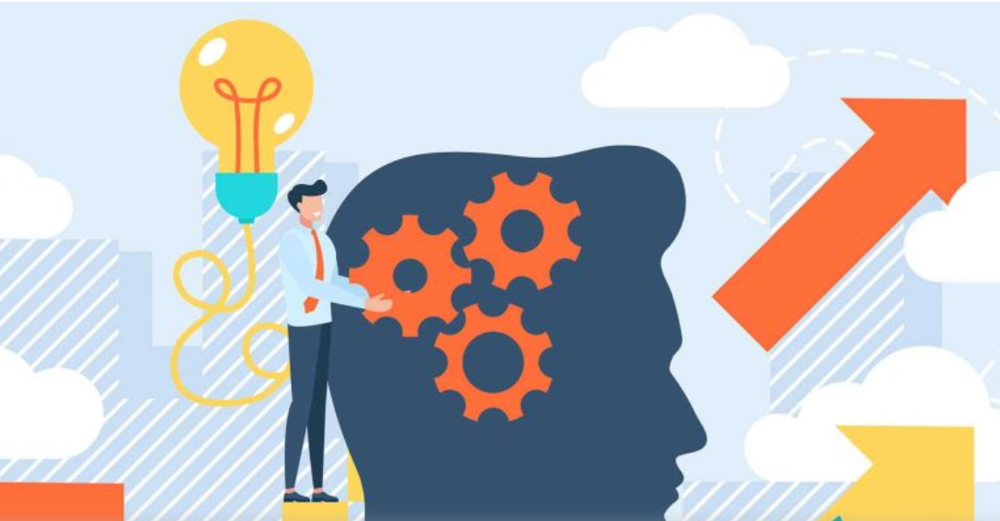
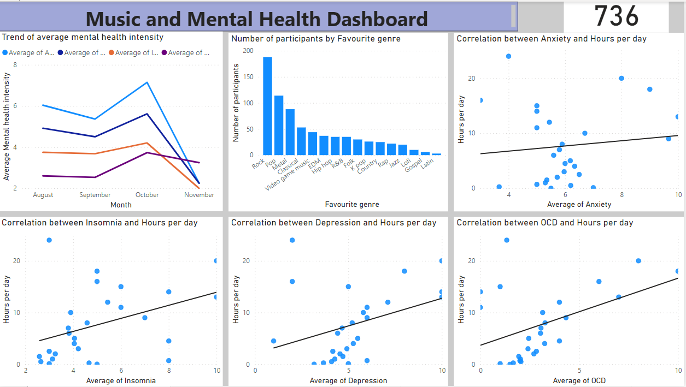
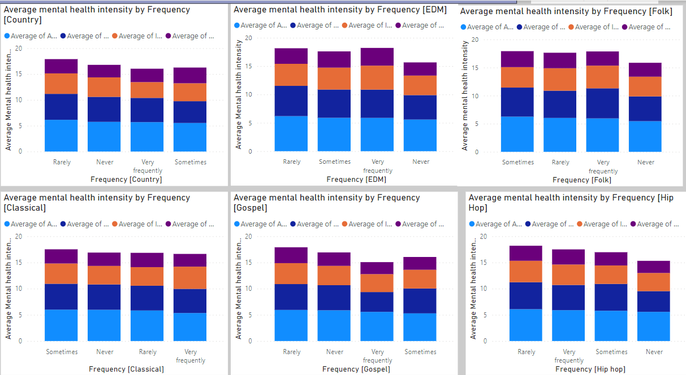
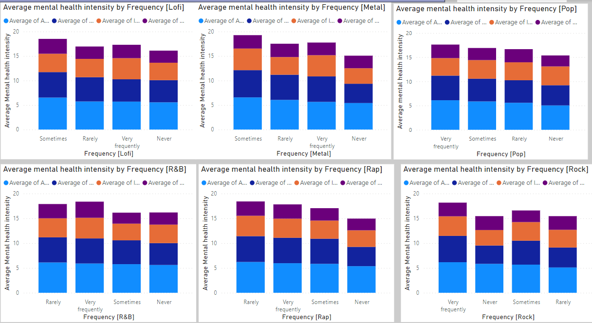
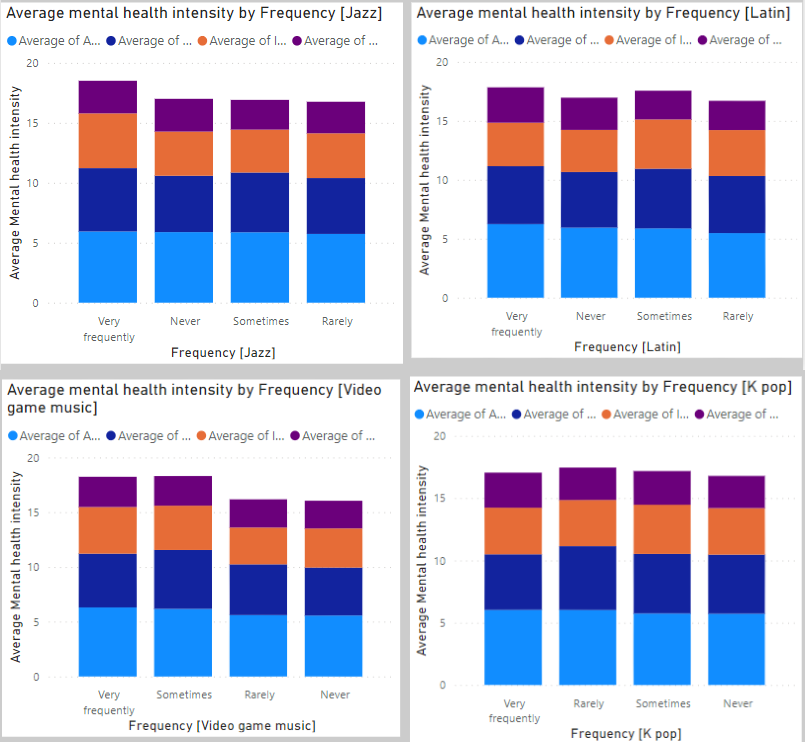

# MUSIC AND MENTAL HEALTH ANALYSIS

Author: Scholar Chepkirui

## Business Understanding

### Project overview
A survey was conducted from August to November 2022, to assess the impact of music on people's mental health and mood in general. The survey recorded responses from over 700 participants and includes details like musical preferences, listening habits, and overall state of mind. Respondents were given 16 genres of music for which they ranked the frequency of listening to each. The responses ranged from never, to very frequently. Moreover, the respondents also ranked the intensity of their feelings of anxiety, depression, insomnia, and OCD on a scale of 1 to 10. 0 being the lowest in intensity to 10 being the highest. Using data from the survey, this project aims to generate insights about the correlation between music genres and the different states of mental health of participants.

### Problem statement
JB Music Therapy is a team of Certified Music Therapists who collaborate, design, and personalize therapy with their clients that will foster desired change: boost mood, decrease stress, strengthen relationships, increase focus, develop learning, reduce anxiety, rehab after an injury, and recover lost memories. JB Music Therapy is the largest employer of Music Therapists in Canada. The core services offered by JB Music Therapy are individual therapy, group programs and public education. The project explores the relationship between music genres and mental health. This helps in providing music recommendations that can be best used during therapy sessions.

## Methods
This project uses exploratory descriptive analysis. The steps taken to achieve useful insights include importing the required libraries and loading the datasets, data understanding, data cleaning and data visualization. Data visualization was done using Power BI

## Results

The participants with the lowest intensity of feelings of anxiety, depression, insomnia, and OCD:
- Never listen to EDM, Folk, Hip hop, K pop, Lofi, Metal, Pop, R&B, Rap and Video game music genres.
- Rarely listen to Jazz, Latin and Rock genres.
- Sometimes listen to Country and Gospel music genres.
- Very frequently listen to Classical genres.

## Conclusions and recommendations
People with high levels of anxiety, depression, insomnia, and OCD should spend more hours per day listening to music.

The music genre that should often be used during therapy sessions is Classical.

Other music genres that should be considered are Country and Gospel music genres.

##  For More Information
See the full analysis in the [Jupyter Notebook](https://github.com/Scholarchep/Music-and-Mental-Health-Analysis/blob/main/music_therapy.ipynb) or review this [presentation](https://github.com/Scholarchep/Music-and-Mental-Health-Analysis/blob/main/music_therapy_presentation.pdf).
For additional information, contact Scholar Chepkirui at scholarchepkirui@gmail.com

## Repository Structure
├── images                                         <- Both sourced externally and generated from code  
├── zippedData                                     <- Both sourced externally and generated from code  
├── README.md                                      <- The top-level README for reviewers of this project  
├── presentation.pdf                               <- PDF version of project presentation  
└── student.ipynb                                  <- Narrative documentation of analysis in Jupyter notebook  

